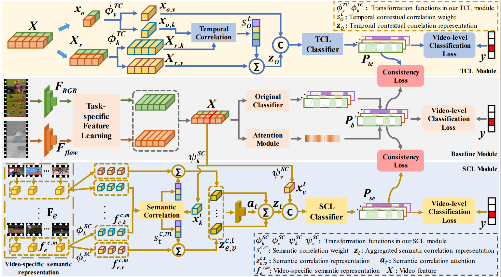

# STCL-Net: Semantic and Temporal Contextual Correlation Learning for Weakly-Supervised Temporal Action Localization
### Official Pytorch Implementation of '[Semantic and Temporal Contextual Correlation Learning for Weakly-Supervised Temporal Action Localization](https://ieeexplore.ieee.org/stamp/stamp.jsp?tp=&arnumber=10155179)' (TPAMI 2023)

> **Semantic and Temporal Contextual Correlation Learning for Weakly-Supervised Temporal Action Localization** 
> Jie Fu, Junyu Gao and Changsheng Xu
>
> Paper: https://ieeexplore.ieee.org/stamp/stamp.jsp?tp=&arnumber=10155179
>
> **Abstract:** *Weakly-supervised temporal action localization (WSTAL) aims to automatically identify and localize action instances in untrimmed videos with only video-level labels as supervision. In this task, there exist two challenges: (1) how to accurately discover the action categories in an untrimmed video (what to discover); (2) how to elaborately focus on the integral temporal interval of each action instance (where to focus). Empirically, to discover the action categories, discriminative semantic information should be extracted, while robust temporal contextual information is beneficial for complete action localization. However, most existing WSTAL methods ignore to explicitly and jointly model the semantic and temporal contextual correlation information for the above two challenges. In this paper, a Semantic and Temporal Contextual Correlation Learning Network (STCL-Net) with the semantic (SCL) and temporal contextual correlation learning (TCL) modules is proposed, which achieves both accurate action discovery and complete action localization by modeling the semantic and temporal contextual correlation information for each snippet in the inter- and intra-video manners respectively. It is noteworthy that the two proposed modules are both designed in a unified dynamic correlation-embedding paradigm. Extensive experiments are performed on different benchmarks. On all the benchmarks, our proposed method exhibits superior or comparable performance in comparison to the existing state-of-the-art models, especially achieving gains as high as 7.2% in terms of the average mAP on THUMOS-14. In addition, comprehensive ablation studies also verify the effectiveness and robustness of each component in our model.*

## STCL-Net Framework

## Prerequisites
### Recommended Environment
* numba==0.47.0
* numpy==1.18.1
* opencv-python==4.1.2.30
* Pillow==6.2.2
* scikit-image==0.17.2
* scikit-learn==0.22.2.post1
* scipy==1.4.1
* seaborn==0.11.0
* six==1.13.0
* tensorboard==2.4.0
* tensorboard-logger==0.1.0
* tensorboard-plugin-wit==1.6.0.post3
* tensorflow-estimator==1.15.1
* torch==1.4.0
* torchvision==0.5.0
* tqdm==4.41.1

### Depencencies
You can set up the environments by using `$ pip3 install -r requirements.txt`.

### Data Preparation (Please refer to [CO2-Net](https://github.com/harlanhong/MM2021-CO2-Net) for more details.)
1. Prepare [THUMOS'14](https://www.crcv.ucf.edu/THUMOS14/) dataset.
    - We excluded three test videos (270, 1292, 1496) as previous work did.

2. Extract features with two-stream I3D networks
    - We recommend extracting features using [this repo](https://github.com/piergiaj/pytorch-i3d).
    - For convenience, we provide the features we used. You can find them [here](https://drive.google.com/file/d/1NqaDRo782bGZKo662I0rI_cvpDT67VQU/view?usp=sharing).

3. Place the features inside the `dataset` folder.
    - Please ensure the data structure is as below.
   
~~~~
├── dataset
   └── THUMOS14
      └── Thumos14reduced
         └── gt.json
      └── Thumos14reduced-Annotations
         ├── Ambiguous_test.txt
         ├── classlist.npy
         ├── duration.npy
         ├── extracted_fps.npy
         ├── labels.npy
         ├── labels_all.npy
         ├── original_fps.npy
         ├── segments.npy
         ├── subset.npy
         └── videoname.npy
     └── gt_all_th14.json
     └── Thumos14reduced-I3D-JOINTFeatures.npy
~~~~

## Usage

You can easily train and evaluate the model by running the script below.

If you want to try other training options, please refer to `options.py`.

~~~~
$ bash train.sh
~~~~

## Trained Model
The best model is available at [https://drive.google.com/file/d/1b-4fXyn2TEH4FiKRxxBRYJqiny_K40nh/view?usp=sharing](https://drive.google.com/drive/folders/1IH0xNx_ZM07syYQYLcTHOYWnxpG9J55V)https://drive.google.com/drive/folders/1IH0xNx_ZM07syYQYLcTHOYWnxpG9J55V

## References
This repo was mainly built upon the previous method.
* Cross-modal Consensus Network for Weakly Supervised Temporal Action Localization (ACM MM 2021) [[paper](https://arxiv.org/abs/2107.12589)] [[code](https://github.com/harlanhong/MM2021-CO2-Net)]

We referenced the repos below for the code.

* [CO2-Net](https://github.com/harlanhong/MM2021-CO2-Net)

## Citation
If you find this code useful, please cite our paper.

~~~~
@article{fu2023semantic,
  title={Semantic and Temporal Contextual Correlation Learning for Weakly-Supervised Temporal Action Localization},
  author={Fu, Jie and Gao, Junyu and Xu, Changsheng},
  journal={IEEE Transactions on Pattern Analysis and Machine Intelligence},
  year={2023},
  publisher={IEEE}
}
~~~~
